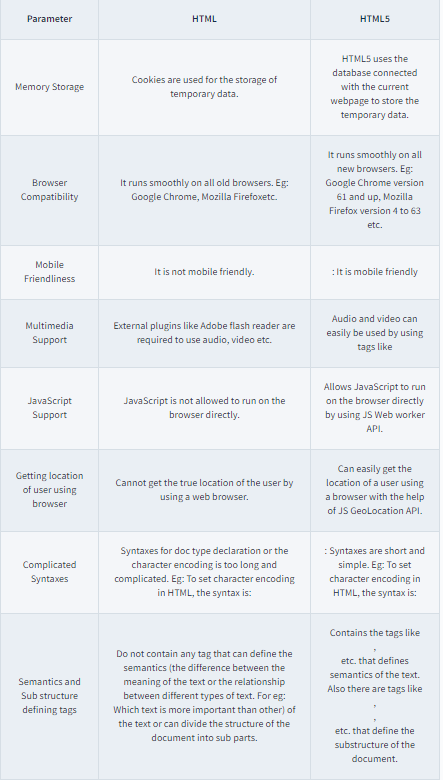
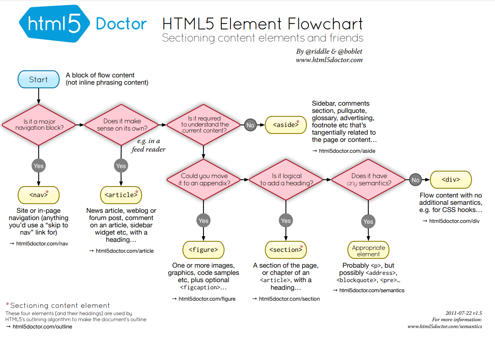

# DIFFERENCE BETWWEN HTML AND HTML5

> Like HTML, the structure of HTML5 is the same: Head and body.

## Body

> Along with normal HTML tags there are also new tags like <header>, <footer>, <article>, <video>, <audio> etc.

## Differences Table

[Table Reference](https://www.scaler.com/topics/difference-between-html-and-html5/)

## HTML5 Elements

## HTML Semantics Cheat Sheet Source

[Source Link](https://learn-the-web.algonquindesign.ca/topics/html-semantics-cheat-sheet/#data-code)